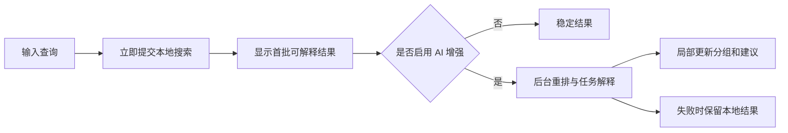

# Octopus 前端 UI/UX 设计草案

> 文档状态：交互设计提案 v0.1  
> 日期：2026-07-15  
> 上位文档：[Octopus 产品设计书：本地资料导航与任务装配层](OCTOPUS_PRODUCT_DESIGN_PROPOSAL.md)  
> 说明：本文描述目标交互与界面结构，不代表当前版本已经实现。

## 0. 设计结论

Octopus 的前端不应继续以“仓库管理器”为中心，也不应变成一个只有聊天框的 AI 应用。最佳形态是一个安静、明确、可反复工作的桌面资料工作台。

用户进入产品后只需要理解四件事：

1. 我正在使用哪个**资料空间**。
2. 我现在要**找资料、做任务，还是看变化**。
3. 当前结果为什么值得相信，证据在哪里。
4. 哪些资料已经进入当前**任务包**，接下来可以做什么。

主交互闭环：

```text
输入目标 -> 浏览候选 -> 核验证据 -> 加入任务包 -> 排序/补缺 -> 打开、导出或交给 Agent
```

前端最重要的三个设计决定：

- 使用**三栏工作台**保持资料空间、结果和证据同时可见。
- 使用**任务包托盘**承接搜索结果，避免用户找到资料后重新整理一遍。
- 使用**渐进式 AI 增强**，本地结果先到，AI 不阻塞、不覆盖、不制造新的页面心智。

## 1. UX 目标与衡量标准

### 1.1 首要体验目标

| 目标 | 用户感受 | 可验证标准 |
| --- | --- | --- |
| 进入即会用 | 不需要先学习 Raw、Index、Leaf 等概念 | 新用户能在没有说明书的情况下发起首次搜索 |
| 结果可信 | 清楚为什么命中、来源在哪里、是否过期 | 每条结果都有命中原因、位置和状态 |
| 不丢上下文 | 查看详情、切换结果、加入任务包时搜索不消失 | 主要操作不依赖多层弹窗或页面跳转 |
| 找到之后能继续 | 可以直接组装任务资料，而不是停在结果列表 | 任意结果最多一次操作加入当前任务包 |
| 异步过程可理解 | 知道系统正在做什么，但不被技术日志打扰 | 本地、AI、索引更新分别显示可理解状态 |
| 错误可恢复 | 失败时有下一步，不需要猜命令 | 所有阻断状态提供重试、忽略或查看详情动作 |

### 1.2 体验优先级

```text
结果可用性 > 证据可信度 > 操作连续性 > 视觉表现 > 图谱新颖性
```

任何会让结果更“炫”但增加等待、隐藏来源或打断任务的设计，都不应进入默认流程。

## 2. 用户心智与界面语言

### 2.1 用户可见对象

| 技术对象 | 默认界面名称 | 出现位置 |
| --- | --- | --- |
| Raw + Index Repository | 资料空间 | 空间切换、设置 |
| Raw file | 原文件 / 来源 | 搜索结果、证据面板 |
| Leaf | 文件卡 | 仅在高级详情说明底层类型 |
| FolderNode | 文件夹指南 | 搜索结果、文件夹详情 |
| Manifest / watcher | 更新状态 | 最近变化、健康中心 |
| Search report | 搜索说明 | 结果页的“本次搜索”折叠区 |
| Markmap | 关系图 / 大纲导出 | 任务包视图和导出菜单 |
| Package Plugin | 导出副本 | 任务包导出 |

### 2.2 文案规则

- 使用“资料空间”，不使用“仓库”，除非进入高级设置。
- 使用“正在整理资料”，不使用“正在构建索引事务”。
- 使用“这份资料仍在编辑，稍后再处理”，不直接显示 `pending_stable`。
- 使用“来源已经移动或不可访问”，不直接显示 `orphaned`。
- 使用“重新整理搜索数据”，不在主界面强调“重建 SQLite 缓存”。
- 按钮使用明确动作：“打开原文件”“加入任务包”“重试这 3 项”，避免“确定”“处理”。
- AI 生成内容统一标记“AI 建议”，不用拟人化语气描述系统行为。

### 2.3 不应暴露的概念

以下概念默认只在“资料空间健康 > 技术详情”中出现：

- Schema 版本
- Manifest 状态
- 事务 ID
- 缓存路径
- Provider 错误原文
- Token 统计明细
- Raw/Index 绝对路径

普通用户只看到这些信息的行动含义。

## 3. 整体信息架构

### 3.1 一级导航

一级导航固定为五项：

1. **工作台**：默认首页，继续最近任务、发起查找或做任务。
2. **搜索**：查看当前查询、筛选和完整结果。
3. **任务包**：查看、编辑、导出已保存任务包。
4. **最近变化**：查看新增、修改、失效及受影响任务包。
5. **资料空间**：切换空间，并进入空间设置与健康状态。

“设置”和“帮助”放在左下角，不与日常主流程并列。

### 3.2 应用壳层

```text
┌──────────────────────────────────────────────────────────────────────────────┐
│ Octopus   资料空间：项目资料⌄          Ctrl+K 查找               已同步 3 分钟 │
├──────────────┬──────────────────────────────────────┬────────────────────────┤
│ 工作台       │                                      │ 证据检查器             │
│ 搜索         │           当前主内容区               │                        │
│ 任务包       │                                      │ 选中结果的摘要、锚点、 │
│ 最近变化     │                                      │ 路径、质量与动作       │
│              │                                      │                        │
│ 资料空间     │                                      │                        │
│              │                                      │                        │
│ ───────────  │                                      │                        │
│ 设置  帮助   │                                      │                        │
├──────────────┴──────────────────────────────────────┴────────────────────────┤
│ 当前任务包：季度汇报 · 8 项资料 · 2 项待核验             展开  检查更新  导出 │
└──────────────────────────────────────────────────────────────────────────────┘
```

### 3.3 布局尺寸

- 推荐桌面最小尺寸：`1100 × 720`。
- 左侧导航：默认 216px，可折叠到 56px。
- 中间工作区：最小 500px，承担主要滚动。
- 右侧证据检查器：默认 360px，可在 320-480px 之间拖动。
- 任务包托盘：折叠态 48px，展开态占窗口高度 35%-55%。
- 窗口宽度小于 1100px 时，右侧证据检查器改为覆盖式抽屉。
- 窗口宽度小于 900px 时，左侧导航自动折叠，仅保留图标与工具提示。

主布局使用稳定列宽，加载、状态文字或按钮变化不得导致三栏跳动。

## 4. 全局交互模型

### 4.1 全局命令入口

顶部 `Ctrl+K` 入口在任意页面可用，激活后展示：

- 搜索当前资料空间
- 发起新任务
- 切换资料空间
- 打开最近任务包
- 查看待处理变化

命令面板只承担快速跳转和发起动作，不复制完整搜索结果页。

### 4.2 导航保留状态

- 从搜索进入任务包后，返回搜索应保留查询、筛选、滚动位置和选中结果。
- 切换一级导航不清空当前任务包。
- 切换资料空间时，如果任务包引用当前空间，先提示任务包将保留但暂不可编辑。
- 关闭应用后恢复最近资料空间、最近一级页面和未完成任务包草稿。
- 搜索查询只有用户点击“清空”或发起新任务时才重置。

### 4.3 选择模型

结果列表支持三种选择：

- **焦点选择**：单击一项，只更新右侧证据检查器。
- **任务选择**：点击“加入任务包”或勾选，将来源加入当前任务包。
- **范围选择**：Shift/Ctrl 多选后批量加入、标记或排除。

焦点选择不会自动加入任务包，避免用户只是查看时产生隐式状态变化。

### 4.4 撤销

以下操作完成后显示 5-8 秒轻量撤销提示：

- 从任务包移除来源
- 排除搜索结果
- 修改用户标记
- 取消某项 AI 建议
- 关闭未保存的任务槽位

不支持真正撤销的操作，如导出副本，只显示结果和打开位置。

## 5. 页面一：首次使用与添加资料空间

### 5.1 首次启动

首次启动不显示空的仓库表格，而显示一个单任务页面：

```text
Octopus

让已有文件夹变得可查找、可核验、可组合。
Octopus 不会修改你选择的原文件。

[选择一个资料文件夹]

也可以：使用示例资料体验
```

不在第一屏要求 API Key、索引路径、扫描间隔或高级排除规则。

### 5.2 添加流程

采用三步向导，每一步只完成一个决定。

#### 步骤 1：选择资料

- 主操作：选择已有文件夹。
- 选择后显示文件数量、估算大小、主要格式和不可访问项。
- 如果选择系统盘根目录或过大范围，提示建议选择更具体的文件夹，但允许高级用户继续。
- 如果检测到 Git、软件包或大量小文件，提供“把这个文件夹作为整体资料”的建议。

#### 步骤 2：确认处理方式

默认选项：

- 原文件保持不变：开启且不可取消。
- 本地整理：开启。
- AI 增强摘要：关闭。
- 自动保持更新：开启。

索引目录由系统自动建议，“更改存储位置”放入展开区。

#### 步骤 3：开始使用

- 显示处理进度，但不使用长日志。
- 按阶段显示：“正在查看文件结构”“正在提取可搜索信息”“正在整理文件夹”。
- 一旦有首批可搜索结果，主按钮变为“开始查找”，后台继续完成剩余处理。
- 用户可以安全暂停；暂停后已完成结果继续可用。

### 5.3 首次完成页

显示真实的三个建议动作，而不是祝贺页面：

- 搜索一个检测到的高频主题。
- 查看最近修改的资料。
- 创建一个“了解这个资料空间”的任务。

首次使用的成功事件是“打开有用来源”或“保存任务包”，不是进度达到 100%。

## 6. 页面二：工作台

### 6.1 页面目的

工作台回答“我接下来可以继续什么”，不是数据看板。

### 6.2 页面结构

```text
早上好，继续处理你的资料

┌─────────────────────────────────────────────────────────────┐
│ 查找文件或描述你正在做的任务...                            │
│ [找资料] [做任务] [看变化]                           [执行] │
└─────────────────────────────────────────────────────────────┘

继续任务
季度汇报 · 8 项资料 · 2 项有更新                     [继续]

最近打开
需求文档.pdf        预算总表.xlsx        会议纪要.docx

需要处理
3 项资料仍在编辑 · 1 项来源不可访问                  [查看]
```

### 6.3 首页内容优先级

1. 主输入框。
2. 未完成或受影响的任务包。
3. 最近打开和最近搜索。
4. 真正需要用户处理的异常。

不展示无行动价值的总文件数、索引节点数、数据库大小或成功率图表。

### 6.4 主输入框

主输入框支持三种模式，使用分段控制而不是三个独立页面：

- 找资料：占位示例“找到去年客户 A 的最终报价表”。
- 做任务：占位示例“准备项目复盘需要的需求、决策和结果资料”。
- 看变化：占位示例“这个项目最近一周发生了什么”。

用户输入内容后切换模式时保留文本，并根据模式调整结果解释。系统可以提示更合适的模式，但不自动切换。

## 7. 页面三：搜索与结果

### 7.1 搜索状态流



### 7.2 查询栏

查询栏保持固定在主内容顶部，包含：

- 查询输入。
- 当前模式分段控制。
- 搜索范围：“当前资料空间 / 指定文件夹 / 所有资料空间”。
- 筛选按钮。
- AI 增强状态按钮。

用户按 Enter 提交；输入过程中只展示历史和建议，不对大型资料空间持续发起完整搜索。停顿后的轻量建议不得改变结果页状态。

### 7.3 结果分组

默认分组顺序：

1. **核心资料**：直接满足查询或任务槽位。
2. **相关文件夹**：适合继续缩小范围的 Folder Guide。
3. **补充资料**：关联明确但不是首选。
4. **需要核验**：可能相关，但存在过期、OCR、来源或版本风险。

当某组为空时不显示空标题。用户可切换“按相关度 / 按时间 / 按文件夹”视图，但默认分组仍围绕行动价值。

### 7.4 结果行

结果使用密集列表行，不采用大面积卡片瀑布流。

```text
□ 需求说明书.pdf                                         PDF
  项目最终需求及验收范围
  命中：“交付范围” · 第 12 页 · 项目A / 02需求
  更新于 3 个月前 · 提取正常
                                      [打开] [加入任务包]
```

固定字段：

- 选择框。
- 文件类型图标和名称。
- 一句话摘要，最多两行。
- 命中原因和最佳锚点。
- 路径面包屑。
- 新鲜度与质量状态。
- 主要动作“打开”和次要动作“加入任务包”。

悬停只增强操作可见性，不隐藏关键事实。双击结果打开推荐目标，单击只聚焦证据检查器。

### 7.5 筛选

筛选抽屉包含：

- 文件类型
- 文件夹范围
- 修改时间
- 索引状态
- 抽取质量
- 用户标记
- 是否已加入当前任务包

已生效筛选以可移除标签显示在查询栏下方。筛选更新结果后保留当前焦点；若当前结果消失，焦点移动到同组下一项并给出轻量说明。

### 7.6 AI 增强的界面行为

- 默认先显示本地结果。
- AI 工作时在查询栏显示“小范围正在增强”，不覆盖结果列表。
- AI 完成后只更新排序、任务槽位和解释，变动项短暂高亮。
- 用户可以点击“查看变化”，了解哪些结果被提升或补充。
- AI 失败时显示“AI 增强未完成，以下是完整本地结果”，并提供一次重试。
- 不使用全屏等待动画，不清空已经出现的结果。

### 7.7 搜索空状态

没有结果时按原因区分：

- 查询过窄：建议删除具体筛选或使用文件名片段。
- 资料仍在处理：显示当前可用范围和预计下一批结果。
- 当前空间确实无匹配：提供搜索所有空间、查看最近变化或浏览相关文件夹。
- 搜索数据异常：提供“重新整理搜索数据”，并说明原文件不受影响。

不使用单一的“无结果”页面。

## 8. 右侧证据检查器

### 8.1 角色

证据检查器是整个产品建立信任的关键界面。用户在不离开结果列表的情况下完成判断。

### 8.2 信息顺序

1. 文件名、类型和用户标记。
2. 推荐动作：打开最佳位置、加入任务包。
3. 为什么命中。
4. 一句话摘要和适用场景。
5. 证据位置列表。
6. 路径、修改时间、索引时间和版本提示。
7. 抽取质量与风险。
8. 相关资料。
9. 高级索引详情。

### 8.3 锚点交互

证据位置以可点击条目展示：

```text
第 12 页 · 交付范围
“一期交付包含数据清洗、检索和导出……”

Sheet：预算 · B12:F28
预算分类与审批状态
```

- 单击锚点更新预览或复制定位信息。
- 双击或点击打开图标，在支持的应用中打开原文件。
- 如果系统不能直接跳转到页/Sheet，明确显示“将打开文件，请前往第 12 页”，不假装已经精确定位。
- OCR 或结构识别不可靠时，在锚点旁显示质量提示。

### 8.4 相关资料

相关资料默认只显示 3-5 项，并给出关系原因：

- 位于同一项目文件夹
- 明确引用此文件
- 是较新的版本
- 曾与它一起加入任务包
- AI 建议，相关度中等

点击“查看关系”才进入任务范围关系视图，不在检查器中展开大型图。

### 8.5 面板状态

- 未选择结果：显示简短提示和键盘操作，不显示空白大框。
- 多选结果：显示批量摘要、共同路径和批量加入动作。
- 来源不可访问：保留已有索引信息，并提供重新定位或从任务包移除。
- 索引正在更新：显示旧证据仍可用，但可能不是最新版本。

## 9. 页面四：做任务

### 9.1 与普通搜索的区别

“找资料”按相关性返回结果；“做任务”先建立任务结构，再为每个结构寻找资料。

示例：用户输入“准备新能源项目季度汇报”。

系统返回：

```text
任务：新能源项目季度汇报

目标与范围       2 项已确认
项目进展         3 项候选
预算与资源       1 项待核验
风险与决策       缺少资料
结果与下一步     2 项候选
```

### 9.2 任务槽位

每个槽位包含：

- 槽位名称和用途。
- 已确认来源。
- 系统候选及加入原因。
- 缺口状态。
- “继续查找此部分”动作。

AI 可以建议拆分，但用户能够重命名、合并、删除和新增槽位。AI 不得静默把候选标记为已确认。

### 9.3 候选确认

候选有三种状态：

- 已确认：用户明确加入任务包。
- 待核验：相关但存在质量、版本或范围不确定性。
- 已排除：本任务不使用，保留排除原因以避免重复推荐。

单击候选仍在右侧查看证据；点击“确认加入”才改变任务包状态。

### 9.4 从任务到任务包

首次确认任一来源时，底部任务包托盘自动出现。任务名称默认使用用户输入，可随时修改。

任务模式不会产生一篇长答案作为完成信号。完成信号是：

- 必需槽位已有来源，或
- 用户明确接受某些缺口，并
- 任务包已保存或执行导出动作。

## 10. 任务包托盘与任务包页面

### 10.1 折叠托盘

任务包托盘始终位于窗口底部：

```text
季度汇报 · 8 项资料 · 2 项待核验 · 1 项有更新       [展开] [检查更新] [导出]
```

用户可以在不离开搜索的情况下知道当前任务包状态。

### 10.2 展开托盘

展开后显示紧凑列表：

- 拖动排序。
- 修改所属槽位。
- 标记已确认/待核验。
- 查看锚点。
- 移除并可撤销。
- 一键进入完整任务包页面。

展开托盘不遮挡查询栏；中间结果区压缩高度并保持滚动位置。

### 10.3 完整任务包页面

任务包页面包含四个标签页：

- **资料**：主视图，按槽位或阅读顺序展示。
- **大纲**：编辑导出的 Markdown 结构和资料引用位置。
- **关系**：展示当前任务范围的有限证据关系图。
- **变化**：展示来源新鲜度和自保存以来的变化。

默认进入“资料”，不默认进入图。

### 10.4 任务包头部

固定显示：

- 任务名称。
- 目标说明。
- 资料空间范围。
- 最近检查时间。
- 已确认、待核验、缺口和有更新数量。
- 保存状态。
- 主动作“继续查找资料”。
- 次动作“导出”。

### 10.5 导出流程

点击“导出”后先选择目的，不直接弹出文件夹：

1. 导出带链接 Markdown。
2. 生成可点击关系图/Markmap。
3. 复制资料副本或压缩包。
4. 交给 Agent。

对于会复制文件或传给外部模型的动作，确认页面必须列出：

- 来源数量和总大小。
- 目标位置或目标服务。
- 是否包含原文件、索引摘要或两者。
- 无法访问和待核验项。

确认只针对本次范围，不转化为永久全库授权。

### 10.6 任务包新鲜度

打开旧任务包时自动执行轻量检查：

- 未变化：显示“资料仍为最新”。
- 有更新：标记受影响项，用户可比较旧索引和新索引摘要。
- 来源移动：尝试自动修复链接，无法确认时请求用户选择。
- 来源删除：保留引用记录和已有摘要，不静默移除。

## 11. 页面五：最近变化

### 11.1 页面目的

让用户理解“资料发生了什么”，而不是查看扫描器日志。

### 11.2 页面结构

```text
最近变化          [今天] [7 天] [30 天]      按项目分组⌄

项目 A
  新增 4 项 · 修改 3 项 · 1 个任务包受影响
  预算总表.xlsx       修改 · 今天 10:42
  最终验收报告.pdf    新增 · 昨天

需要处理
  2 项资料仍在编辑
  1 项来源不可访问
```

### 11.3 变化动作

- 查看更新前后的索引摘要差异。
- 打开来源。
- 加入当前任务包。
- 从某个变化集合创建新任务包。
- 查看受影响任务包。
- 对失败项执行重试。

### 11.4 通知策略

默认不弹系统通知。只有以下事件可以申请通知：

- 用户关注的任务包引用发生变化。
- 后台多次重试仍失败。
- 资料空间长期不可访问。
- 用户主动创建的监听条件命中。

常规新增和修改只进入最近变化，不打扰用户。

## 12. 页面六：资料空间与健康中心

### 12.1 资料空间列表

每个空间只显示：

- 名称。
- 最后同步时间。
- 是否需要处理。
- 文件范围概述。
- 打开工作台动作。

不把“更新、校验、修复缓存、诊断”作为每个空间的一级按钮。

### 12.2 空间详情

分为三个标签：

- 概览：资料范围、格式、自动更新和 AI 策略。
- 处理规则：排除项、最小叶片文件夹、扫描频率。
- 健康：待处理、失败、不可访问、索引一致性和诊断。

### 12.3 健康中心

健康中心按用户可执行性排序：

1. 需要现在处理。
2. 系统正在自动恢复。
3. 仅供参考。
4. 技术详情。

每个问题提供：发生了什么、对结果有什么影响、系统已经做了什么、用户下一步是什么。

示例：

```text
3 份 Office 文件仍在编辑
为了避免读取未保存内容，Octopus 会在文件稳定后自动处理。
[稍后自动重试] [查看文件]
```

技术详情使用可复制文本，不直接占据主页面。

## 13. AI、隐私与权限交互

### 13.1 AI 状态不是单个复选框

使用一个带说明的分层菜单：

- 纯本地：搜索和索引不调用外部 AI。
- 摘要增强：允许为指定资料生成紧凑摘要。
- 任务辅助：允许对当前查询的索引候选进行重排与解释。
- 证据生成：只基于已确认任务包生成内容。

每一级显示所需数据范围和是否可能产生费用。

### 13.2 首次启用

首次启用云端 AI 时说明：

- 将发送什么：默认是紧凑索引，不是整个文件夹。
- 发送到哪里：具体供应商和模型。
- 何时调用：索引、搜索或任务生成。
- 如何关闭和清除本地配置。

密钥输入不出现在资料空间向导第一步。

### 13.3 本次授权

调用 Agent、Plugin 或外部模型前，使用范围确认清单。清单支持逐项取消，默认只包含用户已确认的任务包来源。

### 13.4 AI 内容样式

- AI 建议使用浅色标识条和“AI 建议”标签，不使用头像和聊天气泡。
- 引用以可点击编号或来源名称显示。
- 无法引用的句子必须显示“未找到直接来源”。
- 用户可以逐条接受、编辑或忽略，不提供笼统的“一键相信全部”。

## 14. 加载、空状态与错误状态

### 14.1 加载原则

- 0-300ms：不显示加载状态，避免闪烁。
- 300ms-2s：显示局部骨架或行内进度。
- 超过 2s：说明正在进行的具体阶段，并允许用户继续浏览旧结果。
- 超过预期时间：给出取消、后台继续或查看原因。

禁止使用阻塞整个应用的全屏转圈，除非本地服务尚未连接且任何数据都不可用。

### 14.2 空状态必须有下一步

| 空状态 | 主文案 | 主动作 |
| --- | --- | --- |
| 没有资料空间 | 选择已有文件夹开始使用 | 添加资料空间 |
| 没有搜索结果 | 当前范围没有找到匹配资料 | 放宽条件 |
| 没有任务包 | 从一次搜索选择资料，建立第一个任务包 | 发起任务 |
| 没有变化 | 当前时间范围内没有资料变化 | 调整时间范围 |
| 没有异常 | 资料空间运行正常 | 返回工作台 |

### 14.3 错误严重度

- 行内错误：单个结果、锚点或 AI 建议失败，不影响其他内容。
- 页面错误：当前搜索或任务包无法加载，保留导航和恢复动作。
- 全局错误：本地服务不可用或契约不兼容，显示独立恢复页。

错误提示避免堆栈和错误码作为主文案。错误码放在“技术详情”中，便于支持定位。

### 14.4 本地服务不可用

恢复页显示：

1. 正在尝试重新连接。
2. 原文件没有受到影响。
3. 用户可以重试连接、重启本地服务或打开诊断。
4. 如果存在上次缓存结果，可允许只读查看。

## 15. 键盘与高效率操作

### 15.1 建议快捷键

| 快捷键 | 动作 |
| --- | --- |
| `Ctrl+K` | 打开全局命令入口 |
| `Ctrl+F` | 聚焦当前页面搜索 |
| `Ctrl+Shift+F` | 搜索所有资料空间 |
| `Ctrl+N` | 新建任务包 |
| `Ctrl+Enter` | 将当前焦点结果加入任务包 |
| `Enter` | 打开焦点结果的推荐目标 |
| `Space` | 展开/收起证据检查器当前区块 |
| `Alt+Left` | 返回上一个上下文 |
| `F5` | 刷新当前资料状态 |
| `Esc` | 关闭抽屉、菜单或取消当前临时选择 |

所有快捷键都必须有菜单入口，不能成为完成任务的唯一方式。

### 15.2 列表导航

- 上下键移动焦点结果。
- 焦点移动实时更新证据检查器，但不滚动主列表以外区域。
- Tab 顺序遵循查询栏、筛选、结果、主要动作、证据面板。
- 多选后右侧变为批量操作模式。

## 16. 可访问性

- 正文和控件文本满足 WCAG AA 对比度。
- 状态不能只用颜色区分，同时使用图标和文字。
- 焦点轮廓始终可见。
- 支持 Windows 文本缩放 125%、150% 和 200%。
- 结果行在 200% 缩放下允许摘要换行，操作区固定不覆盖文字。
- 动态结果更新通过非打扰式辅助技术提示，不抢占键盘焦点。
- 图视图必须提供等价列表视图。
- 拖动排序同时提供“上移/下移”菜单操作。
- 所有图标按钮提供工具提示和可访问名称。

## 17. 视觉与组件规范方向

### 17.1 视觉性格

关键词：安静、可靠、清晰、工作导向。

避免：

- 大面积渐变和装饰性背景。
- 过度圆角和悬浮卡片。
- 深蓝/紫色主导的“AI 产品”视觉套件。
- 每个内容区都做成卡片套卡片。
- 用巨大标题挤压实际工作区。

### 17.2 建议色彩角色

- 页面背景：中性浅灰或近白。
- 主文本：接近黑的中性色。
- 主动作：克制的青绿色。
- 信息和链接：清晰蓝色。
- 待核验：琥珀色。
- 错误：红色。
- AI 建议：与主动作不同的低饱和靛蓝标识，仅作来源区分。

颜色必须按语义使用，不按页面装饰使用。界面不依赖单一色系表达层级。

### 17.3 组件形态

- 按钮圆角不超过 6px。
- 输入框和分段控制保持稳定高度 36-40px。
- 图标按钮优先使用通用图标；实现时使用现有图标库中的 Lucide 图标。
- 结果使用分隔线列表，不使用大卡片网格。
- 任务包和模态框可使用轻量边框容器，不在容器内继续嵌套装饰卡片。
- 状态标签只用于简短状态，不把长句塞入胶囊形标签。
- 字号不随视口宽度缩放；通过布局断点和换行适配。

### 17.4 动效

- 面板展开、结果重排和任务包加入使用 120-180ms 动效。
- AI 补充结果只对变化行做短暂背景提示，不让整页重新排列跳动。
- 禁止持续脉冲、漂浮装饰或无意义加载动画。
- 尊重系统“减少动态效果”设置。

## 18. 关键状态机

### 18.1 搜索状态

```text
idle
  -> local_loading
  -> local_ready
  -> ai_enhancing（可选，与 local_ready 共存）
  -> complete

异常分支：
local_loading -> local_error
ai_enhancing -> ai_degraded（保留 local_ready）
```

界面规则：只有 `local_error` 且无旧结果时才显示页面级错误；`ai_degraded` 永远不覆盖本地结果。

### 18.2 结果状态

```text
normal | focused | selected_for_task | pending | stale | inaccessible | extraction_risk
```

一项结果可以同时处于 `selected_for_task + stale`，界面必须允许组合状态，而不是用单一“状态”列覆盖信息。

### 18.3 任务包状态

```text
draft -> saved -> checking_updates -> up_to_date
                         \-> needs_review
saved -> exporting -> exported
saved -> handing_to_agent -> handed_off
```

导出失败不改变已保存任务包；Agent 交接失败不丢失用户选择。

## 19. 当前桌面端到目标界面的迁移

| 当前区域 | 目标位置 | 迁移原则 |
| --- | --- | --- |
| 仓库列表 | 资料空间切换器和资料空间页 | 保留能力，替换普通用户术语 |
| 概览与操作 | 工作台 + 健康中心 | 日常操作与修复操作分离 |
| 搜索 Treeview | 分组结果列表 + 证据检查器 | 增加上下文、锚点和任务动作 |
| 状态中心 | 最近变化 + 资料空间健康 | 用户变化与技术诊断分离 |
| 更新索引 | 顶部同步状态 / 后台自动更新 | 正常时弱化，异常时可操作 |
| 重试失败项 | 健康中心具体问题动作 | 不作为主页面常驻按钮 |
| 校验 | 健康中心自动检查 | 用户通常无需主动理解 |
| 修复搜索缓存 | 搜索错误恢复动作 | 只在相关问题发生时出现 |
| 打开索引 | 证据检查器高级动作 | 默认主动作是打开来源 |
| AI 增强复选框 | 分级 AI 菜单 | 显示范围、成本和降级语义 |

## 20. 分阶段前端交付建议

### UI Phase 1：搜索可信度

范围：

- 新应用壳层和资料空间术语。
- 工作台主输入。
- 分组结果列表。
- 固定证据检查器。
- 本地优先、AI 后补的加载状态。
- 基础空状态和错误恢复。

验收结果：用户无需进入状态中心即可找到、判断并打开一份资料。

### UI Phase 2：任务闭环

范围：

- 任务包托盘。
- 任务槽位和候选确认。
- 任务包资料/大纲视图。
- Markdown、Markmap 和 Package 导出入口。
- 搜索与任务包之间的状态保留。

验收结果：用户能从一次开放任务建立并保存可执行资料集合。

### UI Phase 3：持续工作

范围：

- 最近变化。
- 任务包新鲜度检查。
- 受影响任务包。
- 空间健康中心和用户化恢复动作。
- 保存视图。

验收结果：用户一周后回来能够理解资料变化并继续原任务。

### UI Phase 4：关系与 Agent

范围：

- 任务范围关系图。
- 关系类型和来源说明。
- Agent 分级授权和交接清单。
- AI 建议逐条接受/忽略。

验收结果：用户能够控制 Agent 使用哪些证据，并复核资料关系。

## 21. 设计验收清单

### 核心路径

- 新用户能在 10 分钟内添加资料空间并打开首个有效来源。
- 用户可以在不离开搜索页的情况下查看摘要、锚点、路径和风险。
- 用户加入任务包时不会丢失查询和滚动位置。
- 用户能明确区分“查看结果”和“确认加入任务”。
- AI 失败时本地结果仍完整可操作。
- 任务包导出前清楚展示涉及的资料范围。

### 状态完整性

- 已覆盖首次加载、部分可用、无结果、AI 降级、来源失效和服务断开。
- 已覆盖任务包草稿、保存、更新检查、导出成功和导出失败。
- 已覆盖单选、多选、筛选导致焦点消失和跨资料空间切换。
- 所有长时间操作都有取消或后台继续方案。

### 交互质量

- 主要工作流不超过一层模态框。
- 日常页面不显示技术状态码。
- 关键动作可以使用键盘完成。
- 图视图不是唯一的信息呈现方式。
- 文本在 125%-200% 缩放下不遮挡按钮或相邻内容。
- 所有危险动作都显示本次作用范围。

## 22. 最终原则

Octopus 前端的判断标准不是“是否像一个先进 AI 产品”，而是用户能否始终回答：

1. 我现在在什么范围里工作？
2. 这个结果为什么出现？
3. 我应该打开哪里？
4. 我已经为当前任务选了哪些资料？
5. 接下来的动作会影响哪些文件？

只要这五个问题始终清楚，Octopus 就能形成与聊天式 RAG、全局知识图谱和普通文件搜索不同的用户体验。

目标体验可以概括为：

> **搜索过程像文件工具一样直接，证据像专业研究工具一样清楚，任务组织像工作台一样连续，AI 像一个可关闭的增强层一样克制。**
